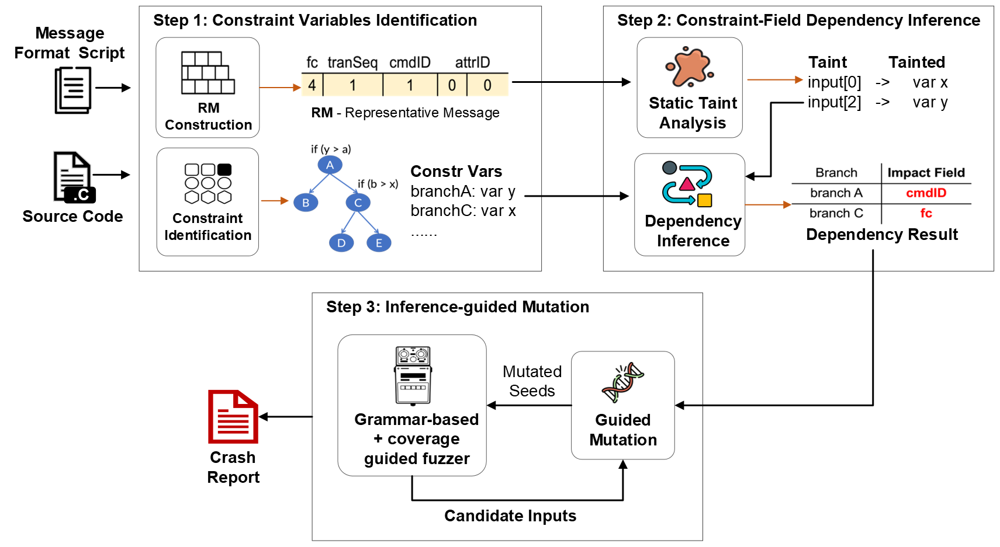

# TaintBFuzz: An Intelligent Mutation Strategy of Zigbee Protocol Fuzzing via Constraint-Field Dependency Inference
TaintBFuzz is a fuzzing platform for Zigbee protocol implementations, which implements an intelligent mutation method with constraint-filed dependency inference. It intends to assist IoT application developers in evaluating the security threats associated with the Zigbee protocol implementation in developing their applications. We leverage static taint analysis to infer the relationship between the message field and the path constraints, which guides the fuzzer to prioritize the critical message fields for mutation.

The following figure shows the workflow of TaintBFuzz framework.


## Installation ##
### System Prequisites ###
* Operating System: Windows 10+.
* Windows Subsystem for Linux (WSL) Ubuntu 18.04.5.
* IAR Embedded Workbench for ARM 8.3+ (require license for usage).
* Python 2.7+. (**No Python3**).
* GCC for ARM compiler for Windows(arm-none-eabi-gcc).
* The Zigbee protocol source code for testing. We currently provide an example of protocol stack driver for testing Texes Instruments Z-Stack implementation. Please import the original source code files to the folder zstack.

### Install Frama-C from Source ###
TaintBFuzz performs static taint analysis using Frama-C, which is a platform dedicated to the analysis of source code written in C. We customized Frama-C's code to parse protocol vendor specific syntax. Please refer the [Frama-C document](https://git.frama-c.com/pub/frama-c/-/blob/master/INSTALL.md#compiling-from-source) to compile the customized code under the folder [frama-c](https://github.com/zigbeeprotocol/TaintBFuzz/tree/main/frama-c).

## Preparation ##
### 1. Preprocess the source code
- Copy your ` zcl.c ` file to the folder [depnInfer](https://github.com/zigbeeprotocol/TaintBFuzz/tree/main/depenInfer). 
- Manually add the required header files ` __fc_builtin.h ` and ` config.h ` (in the folder [depnInfer](https://github.com/zigbeeprotocol/TaintBFuzz/tree/main/depenInfer)). These two files are required for static taint analysis. 
- Run the [zcl_preprocess.bat](https://github.com/zigbeeprotocol/TaintBFuzz/blob/main/depenInfer/zcl_preprocess.bat) to preprocess the source file.
**Remember to update the file path to your own.**

### 2. Manual instrumentation
- Make a copy of the preprocessed source file as `zcl_annot_manual.i`.
- Manually insert the function `Frama_C_dump_each()` before each `return` function in `zcl_annot_manual.i`.
- Manually assign pre-defined values to particular device-related variables based on `config.h`. For example, the end device description variable epDesc defined in `zcl.c` of Z-Stack developed by Texas Instruments. 
**Those variables would be different in other stack implementations developed by other vendors.** You may need to customize them and the pre-defined values in the file `config.h`.

## Step 1: Constraint Variables Identification ##
TaintBFuzz first identifies the constraint variables reasonably and constructs a set of Representative Message (RM) based on the given protocol message format script (protocol message format is defined in [fuzz_zigbee.py](https://github.com/zigbeeprotocol/TaintBFuzz/blob/main/fuzzing/fuzz_zigbee.py)). An RM is defined as a tuple (F, Len,data), where F = (F1, ..., Fn) is a set of message fields defined in the script, Len = (L1, ..., Ln) is the length of every message field, and data is a message sequence with concrete values.

1. Open WSL and navigate to the folder [depnInfer](https://github.com/zigbeeprotocol/TaintBFuzz/tree/main/depenInfer).
2. Run the ocaml script with the following command to collect variables.
    ``` bash
      frama-c -load-script constraint_print.ml -constr-vars -constr-vars-output ./zcl_constraint_variables zcl.i
    ```
3. Run the python script with the following command to generate RMSs. The result is saved as `input_sequences.json`.
    ``` python
      python fuzz_zigbee.py -generate_inputs
    ```

## Step 2: Constraint-Filed Dependency Inference ##
1. Navigate to the folder [depnInfer](https://github.com/zigbeeprotocol/TaintBFuzz/tree/main/depenInfer) and run the python script with the following command to perform static taint analysis on the instrumented source file.
    ``` python
      python static_analysis.py -taint
    ```
2. Run the python script with the following command to infer the dependency based on the taint analysis results. The final result is saved as `zcl_constraint_deps.json`.
    ``` python
      python static_analysis.py -infer
    ```

## Step 3: Inference-guided Mutation ##
We implement our fuzzing engine on the top of [Z-Fuzzer](https://github.com/zigbeeprotocol/Z-Fuzzer), which is a device-agnostic fuzzing platform to detect security vulnerabilities in Zigbee protocol implementations. Please refer its documentation to configure the related files and paths.

To start fuzzing experiment, navigate to the folder [fuzzing](https://github.com/zigbeeprotocol/TaintBFuzz/tree/main/fuzzing) and run the following commands:
  
  Run the proxy server first.
  ```python
     python proxy_zstack.py
  ```
  
  Run the fuzzing engine.
  ```python
     python fuzz_zigbee.py -fuzz
  ```


